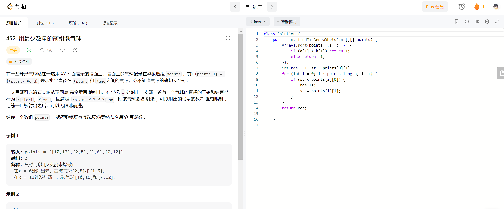

#### 二分

整数二分算法模板

```
bool check(int x) {/* ... */} // 检查x是否满足某种性质

// 区间[l, r]被划分成[l, mid]和[mid + 1, r]时使用：
int bsearch_1(int l, int r)
{
    while (l < r)
    {
        int mid = l + r >> 1;
        if (check(mid)) r = mid;    // check()判断mid是否满足性质
        else l = mid + 1;
    }
    return l;
}
// 区间[l, r]被划分成[l, mid - 1]和[mid, r]时使用：
int bsearch_2(int l, int r)
{
    while (l < r)
    {
        int mid = l + r + 1 >> 1;
        if (check(mid)) l = mid;
        else r = mid - 1;
    }
    return l;
}
```

浮点数二分算法模板 

```
bool check(double x) {/* ... */} // 检查x是否满足某种性质

double bsearch_3(double l, double r)
{
    const double eps = 1e-6;   // eps 表示精度，取决于题目对精度的要求
    while (r - l > eps)
    {
        double mid = (l + r) / 2;
        if (check(mid)) r = mid;
        else l = mid;
    }
    return l;
}
```


###### 790.数的三次方根


```java
import java.util.Scanner;

public class Main {
    public static void main (String[] args) {
        Scanner sc = new Scanner(System.in);
        
        double x = sc.nextDouble();
        double l = -10001, r = 10010;
        while (r - l > 1e-7) {
            double mid = (l + r) / 2;
            if (mid * mid * mid > x) {
                r = mid;
            } else {
                l = mid;
            }
        }
        System.out.printf("%.6f", l);
    }
}
```

#### 排序

##### 快排

##### 归并

#### dp

#### 贪心

###### 905.区间选点 [https://www.acwing.com/problem/content/907/](https://www.acwing.com/problem/content/907/)


```
import java.util.Scanner;
import java.util.Arrays;

public class Main {
    public static final int N = 100010;
    public static int[][] arr = new int[N][2];

    public static void main (String[] args) {
        Scanner sc = new Scanner(System.in);

        int n = sc.nextInt();
        for (int i = 0; i < n; i ++) {
            arr[i][0] = sc.nextInt();
            arr[i][1] = sc.nextInt();
        }

        Arrays.sort(arr, 0, n,  (a, b) -> a[1] - b[1]);

        int res = 0, ed = (int)-2e9;
        for (int i = 0; i < n; i ++) {
            if (ed < arr[i][0]) {
                ed = arr[i][1];
                res ++;
            }
        }
        System.out.println(res);
    }
}
```


```java
import java.util.Scanner;
import java.util.Arrays;
import java.util.Comparator;
public class Main {
    public static final int N = 100010;
    public static pair[] arr = new pair[N];
    
    public static void main (String[] args) {
        Scanner sc = new Scanner(System.in);
        int n = sc.nextInt();
        for (int i = 0; i < n; i ++) {
            int x = sc.nextInt();
            int y = sc.nextInt();
            arr[i] = new pair(x, y);
        }
        Arrays.sort(arr, 0, n, new Comparator<pair>() {
            @Override
            public int compare(pair a, pair b) {
                if (a.y != b.y) return a.y - b.y;
                return a.x - b.x;
            }
        });
        int res = 0, ed = Integer.MIN_VALUE;
        for (int i = 0; i < n; i ++) {
            if (ed < arr[i].x) {
                res ++;
                ed = arr[i].y;
            }
        }
        System.out.print(res);
    }
}
class pair {
    int x;
    int y;
    public pair(int x, int y) {
        this.x = x;
        this.y = y;
    }
}
```

###### 452.用最少数量的箭引爆气球  [https://leetcode.cn/problems/minimum-number-of-arrows-to-burst-balloons/](https://leetcode.cn/problems/minimum-number-of-arrows-to-burst-balloons/)



```java
class Solution {
    public int findMinArrowShots(int[][] points) {
        Arrays.sort(points, (a, b) -> {
            if (a[1] > b[1]) return 1;
            else return -1;
        });
        /*
         注意当 [[-2147483646,-2147483645],[2147483646,2147483647]] 时;
         用 Arrays.sort(points, (a, b) -> a[1] - b[1]); 并不能排序
        */
        int res = 1, st = points[0][1];
        for (int i = 0; i < points.length; i ++) {
            if (st < points[i][0]) {
                res ++;
                st = points[i][1];
            }
        }
        return res;

    }
}
```

###### 179.最大数 [https://leetcode.cn/problems/largest-number/](https://leetcode.cn/problems/largest-number/)


```java
class Solution {
    public String largestNumber(int[] nums) {
        int n = nums.length;
        String[] arr = new String[n];
        for (int i = 0; i < n; i ++) {
            arr[i] = "" + nums[i];
        }
        Arrays.sort(arr, 0, n, (a, b) -> {
            String o1 = a + b, o2 = b + a;
            return o2.compareTo(o1);
        });
        String s = "";
        if (arr[0].equals("0")) return "0"; //注意这里是最大值，可能有0000, 应该输出0
        for (int i = 0; i < n; i  ++) {
            s += arr[i];
        }
        return s;
    }
}
```


#### 前缀和

````
如果我给你一串长度为n的数列a1,a2,a3......an,再给出m个询问，每次询问给出L，R两个数，要求给出区间[L,R]里的数的和，你会怎么做，若是没有了解过前缀和的人看到这道题的想法可能是对于m次询问，我每次都遍历一遍它给的区间，计算出答案，这样子的方法固然没错，但是其时间复杂度达到了O(n*m)，如果数据量稍微大一点就有可能超时，而我们如果使用前缀和的方法来做的话就能够将时间复杂度降到O(n+m),大大节省了运算时间。至于怎么用，请看下面一小段代码
题目来源

```
for(int i=1;i<=n;i++)
   a[i]+=a[i-1];
```

前缀和顾名思义就是前面i个数的总和。数组a在经过这样的操作之后，对于每次的询问，我们只需要计算a[R]-a[L-1]就能得到我们想要的答案了，是不是很简单呢。
````

```
一维差分
在知道了最简单的前缀和之后，我们再来了解一下什么是差分。

给你一串长度为n的数列a1,a2,a3......an，要求对a[L]~a[R]进行m次操作：

操作一：将a[L]~a[R]内的元素都加上c

操作二：将a[L]~a[R]内的元素都减去c

最后再给出一个询问求a[L]-a[R]内的元素之和？

你会怎么做呢？你可能会想，我对于m次操作每次都遍历一遍a[L]~a[R],给区间里的数都加上c或减去c，最后再求一次前缀和就行了。没错，这样子确实也能得出正确答案，但时间复杂度却高达O(M*n)，对于1<=n,m<=1e5这个数据范围来说直接就GG了，所以说这个方法不可行。既然这样不行的话，那我们要怎么做才能快速的得到正确答案呢？是的，这个时候我们的差分就该派上用场了，我们新开一个数组b，储存每一次的修改操作，最后求前缀和的时候统计一下就能快速的得到正确答案了，详细请看下面代码。
```

题目来源

```
#include<iostream>
using namespace std;
const int N=100010;
int a[N],s[N];
int n,m;
void insert(int l,int r,int c){
    s[l]+=c;
    s[r+1]-=c;
}
int main()
{
   cin.tie(0);
   ios::sync_with_stdio(false);
   cin>>n>>m;
   for(int i=1;i<=n;i++){
          cin>>a[i];
          insert(i,i,a[i]);
   }
   while(m--){
       int l, r, c;
       cin>>l>>r>>c;
       insert(l,r,c);
   }
   for(int i=1;i<=n;i++)s[i]+=s[i-1];
   for(int i=1;i<=n;i++)
       cout<<s[i]<<" ";
    return 0;      
}
```

```
为什么操作一时b[r+1]要减去c，很简单，因为操作一我只需对[l,r]区间里的数加c，[r+1,n]这个区间里的数没必要加c，所以需要减掉c。

二维前缀和
给定一个n*m大小的矩阵a，有k次询问，每次询问给定x1,y1,x2,y2四个数，求以(x1,y1)为左上角坐标和(x2,y2)为右下角坐标的子矩阵的所有元素和。注意仍然包含左上角和右下角的元素
```


```
#include<iostream>

using namespace std;

const int N=1010;
int a[N][N],s[N][N];
int n,m,k;

int main(){
    cin.tie(0);
    ios::sync_with_stdio(false);
    cin>>n>>m>>k;
    for(int i=1;i<=n;i++)
      for(int j=1;j<=m;j++){
         cin>>a[i][j];
         s[i][j]=a[i][j]+s[i-1][j]+s[i][j-1]-s[i-1][j-1];
      }
      while(k--){
          int x1,y1,x2,y2;
          cin>>x1>>y1>>x2>>y2;
          cout<<s[x2][y2]-s[x1-1][y2]-s[x2][y1-1]+s[x1-1][y1-1]<<endl;

      }
    return 0;

}
```

```
二维差分
二维是和一维类似的，我们也是需要另开一个数组记录修改操作，最后求前缀和时统计修改操作，只是二维每一次操作要记录4个位置，一维只需要记录2个位置
```


题目来源

```
#include<iostream>
using namespace std;
const int N=1040;
int a[N][N],b[N][N];

int n,m,k;

void insert(int x1,int y1,int x2,int y2,int c){
    b[x1][y1]+=c;
    b[x1][y2+1]-=c;
    b[x2+1][y1]-=c;
    b[x2+1][y1+1]+=c;

}
int main(){
        cin.tie(0);
        ios::sync_with_stdio(false);
    cin>>n>>m>>k;
    for(int i=1;i<=n;i++)
      for(int j=1;j<=m;j++)
      {
          cin>>a[i][j];
          insert(i,j,i,j,a[i][j]);
      }

    while(k--){
        int x1,y1,x2,y2,c;
        cin>>x1>>y1>>x2>>y2>>c;
        insert(x1,y1,x2,y2,c);
    }
    
    for(int i=1;i<=n;i++)
      for(int j=1;j<=m;j++)
         b[i][j]+=b[i-1][j]+b[i][j-1]-b[i-1][j-1];
    
    for(int i=1;i<=n;i++)
    {
      for(int j=1;j<=m;j++)
      {
        cout<<b[i][j]<<" ";
      }
      cout<<endl;
    }
    
    return 0;    

}
```

```
一维前缀和
S[i] = a[1] + a[2] + ... a[i]
a[l] + ... + a[r] = S[r] - S[l - 1]
二维前缀和
S[i, j] = 第i行j列格子左上部分所有元素的和
以(x1, y1)为左上角，(x2, y2)为右下角的子矩阵的和为：

S[x2, y2] - S[x1 - 1, y2] - S[x2, y1 - 1] + S[x1 - 1, y1 - 1]
一维差分
给区间[l, r]中的每个数加上c：

B[l] += c, B[r + 1] -= c
二维差分
给以(x1, y1)为左上角，(x2, y2)为右下角的子矩阵中的所有元素加上c：

S[x1, y1] += c, S[x2 + 1, y1] -= c, S[x1, y2 + 1] -= c, S[x2 + 1, y2 + 1] += c
```


#### 差分