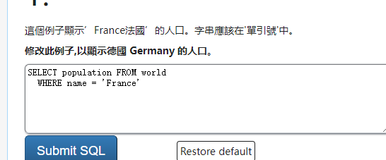

### select

查询 所有列

```sql
select ..
from ..
```




### like %   (查询特定的列)

`WHERE name LIKE 'B%'`來找出以 B 為開首的國家。
%是萬用字元,可以用代表任何字完。

```sql
SELECT name FROM world
  WHERE name LIKE 'Y%'
```

**找出以 Y 為結尾的國家。**

```sql
SELECT name FROM world
  WHERE name LIKE '%Y'
```

“Luxembourg 盧森堡”中有一個x字母,還有一個國家的名字中有x。列出這兩個國家。

找出所有國家,其名字包括字母x。

```sql
SELECT name FROM world
  WHERE name LIKE '%X%'
```

“Iceland 冰島”和“Switzerland 瑞士”的名字都是以”land”作結束的。還有其他嗎?

找出所有國家,其名字以 land 作結尾。

```sql
SELECT name FROM world
  WHERE name LIKE '%land'
```

“Columbia 哥倫比亞”是以 C 作開始,ia 作結尾的。還有兩個國家相同。

找出所有國家,其名字以 C 作開始,ia 作結尾。

```sql
SELECT name FROM world
  WHERE name LIKE 'C%ia'
```

“Greece 希臘”中有雙 e 字。哪個國家有雙 o 字呢?

找出所有國家,其名字包括字母oo。

```sql
SELECT name FROM world
  WHERE name LIKE '%oo%'
```

“Bahamas 巴哈馬”中有三個 a,還有嗎?

找出所有國家,其名字包括三個或以上的a。

```sql
SELECT name FROM world
  WHERE name LIKE '%a%a%a%'
```

### _%

“India 印度”和”Angola 安哥拉”的第二個字母都是 n。
你可以用底線符`_`當作單一個字母的萬用字元。

```
SELECT name FROM world
 WHERE name LIKE '_n%'
ORDER BY name
```
